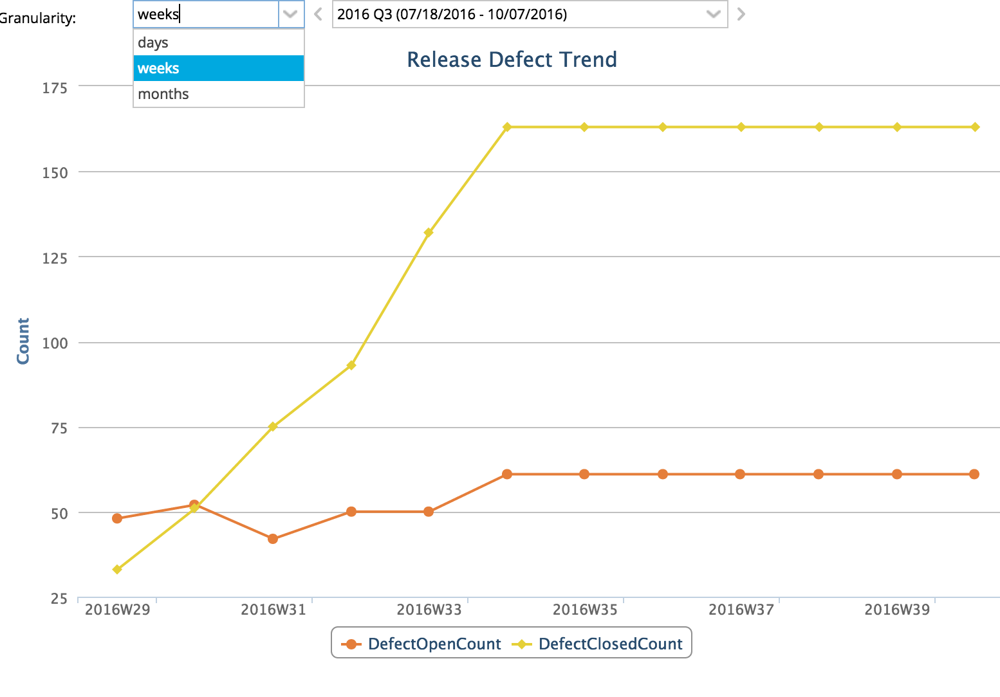

Lookback Defect Trend Filtered Example
=========================

## Overview

## License

Lookback Defect Trend Filtered Example is released under the MIT license.  See the file [LICENSE](./LICENSE) for the full text.

## Documentation for SDK

You can find the documentation on our help [site.](https://help.rallydev.com/apps/2.1/doc/)

## Building

One time installation of rally app builder tool (if you haven't done this already):

    npm install -g rally-app-builder

Generate code:

    rally-app-builder build
