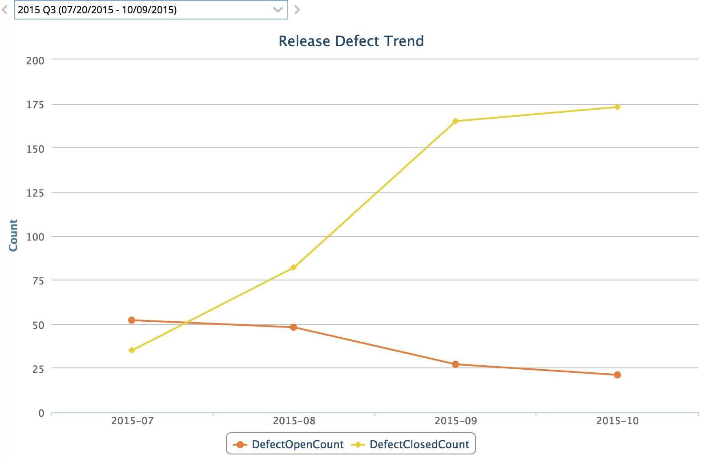
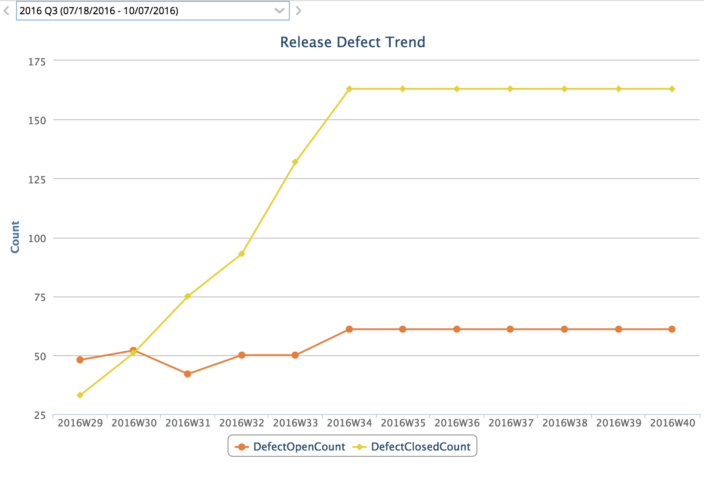

Lookback Defect Trend Filtered Example
=========================

## Overview

Data by months, defined in code: `lumenize.Time.MONTH` :

Data by weeks, defined in code: `lumenize.Time.WEEK` :

## License

Lookback Defect Trend Filtered Example is released under the MIT license.  See the file [LICENSE](./LICENSE) for the full text.

##Documentation for SDK

You can find the documentation on our help [site.](https://help.rallydev.com/apps/2.1/doc/)

